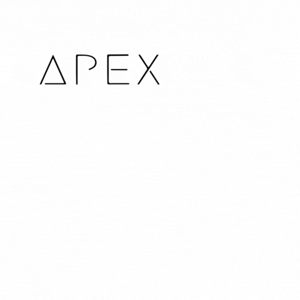
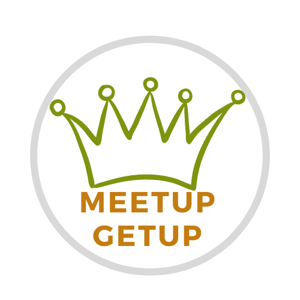
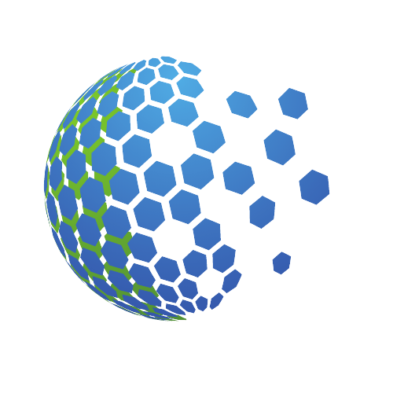
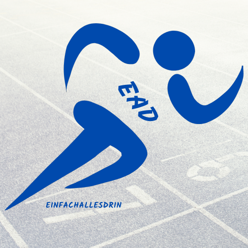

Bekir Cebeci

## Hi, I am a MERN Stack Developer 👩‍💻

🔭 I am looking for a full-time Full Stack Developer position where I can further deepen my knowledge and hone my skills.

🌱 I like to build websites and web applications in JavaScript, React, Nodejs, Mongodb, Express and Angular.

👯 As web development is my passion, I love to learn new Technologies. My goal is to learn more about Python as I am very keen about data science and machine learning.

😄 My Portfolio Codes are Bankapp, MeetupGetup, Freizeitpark, Teknoza (E-Shop). My Focus is full stack. I wrote a well-protected backend for the "Teknoza project". Furthermore, I will add new versions with MySQL and PostgresQL database for this project.

💬 Feel free to ask me anything about my codes or capabilities. I am sure that together we can create great IT solutions for customers.

🔎 Click on the icons to see my code, deployed projects, organizations and articles.

---

## Skills:

 
 
 

---

## New Skills to Develop:

 
 
 

---

## Test Technologies

 
 
 

---

## Github Links of My Projects

 
 
 

---

## Github Links of Team Projects

 
 
 

---

## Deployment Links of Projects

 
 
 

---

## Published npm Packages

 
 
 

---

## Github Organizations

 
 
 

---

## Medium Articles

 
 
 

---

## Project Management

 
 
 

---

## Contact

Feel free to contact..

 
 
 

<!--
**bekircbc/bekircbc** is a ✨ _special_ ✨ repository because its `README.md` (this file) appears on your GitHub profile.

Here are some ideas to get you started:

- 🔭 I’m currently working on ...
- 🌱 I’m currently learning ...
- 👯 I’m looking to collaborate on ...
- 🤔 I’m looking for help with ...
- 💬 Ask me about ...
- 📫 How to reach me: ...
- 😄 Pronouns: ...
- ⚡ Fun fact: ...
-->
